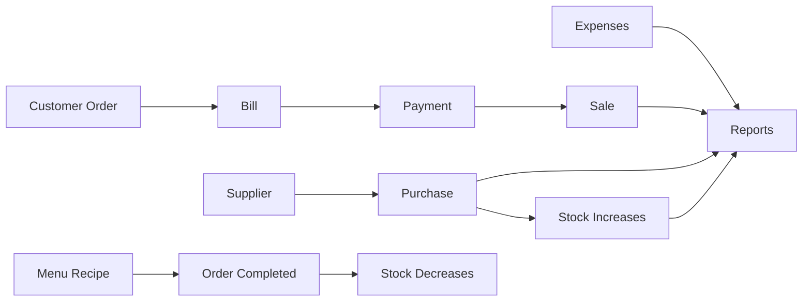
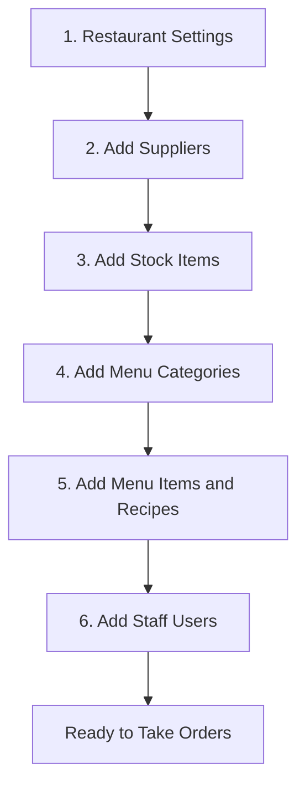
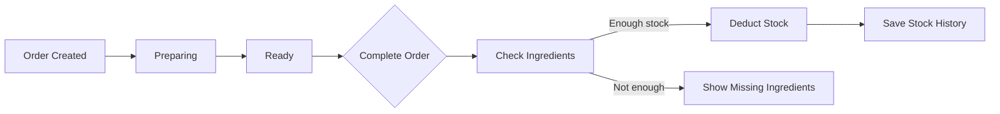
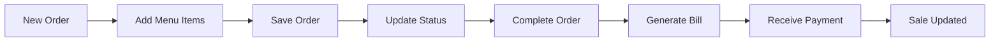
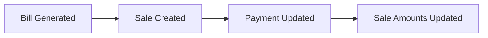
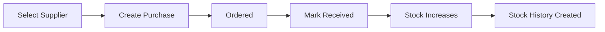
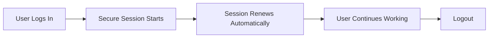
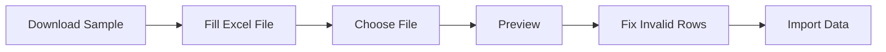
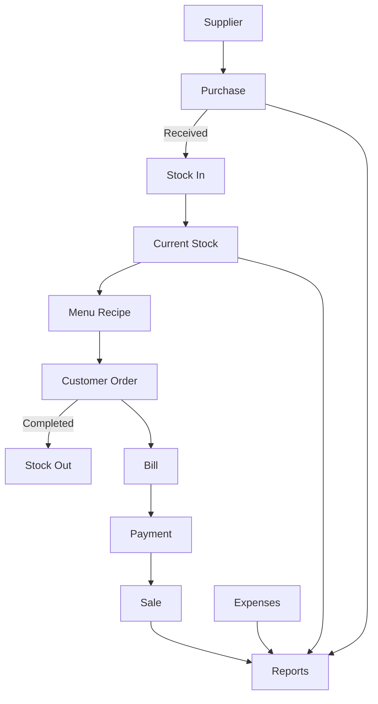

# Restaurant Management Software — Owner Guide

This guide explains how to use the restaurant software in simple language. It is designed for restaurant owners, managers, cashiers, waiters, and staff.

---

## 1. What this software manages



The software helps manage:

- Customer orders
- Bills and payments
- Daily sales
- Supplier purchases
- Kitchen stock
- Menu items and recipes
- Suppliers
- Restaurant expenses
- Business reports
- Staff users and permissions

---

## 2. Recommended first-time setup

Complete these steps before taking real customer orders:



### Step 1: Restaurant Settings

Open **Settings** and enter:

- Restaurant name
- Phone number
- Email
- Address
- GST or Tax number
- Currency
- Bill prefix
- Tax percentage
- Bill footer message
- Low-stock alert settings

Select **Save Settings**.

### Step 2: Add Suppliers

Open **Suppliers → Add Supplier**.

Enter the supplier's:

- Name
- Contact person
- Phone number
- Address
- Email, if available
- GST or Tax number, if available

### Step 3: Add Stock Items

Open **Stock → Add Stock Item**.

Example:

| Field | Example |
|---|---|
| Item Name | Paneer |
| Category | Oil & Dairy |
| Unit | Kg |
| Stock Available Now | 10 Kg |
| Buying Price | ₹400 per Kg |
| Low Stock Alert At | 2 Kg |
| Supplier | Fresh Farm Foods |

Use one unit for each stock item:

- Paneer, rice, flour → Kg or Gram
- Oil, milk, sauce → Litre or ml
- Bun, egg, bottle → Piece

### Step 4: Add Menu Categories

Open **Menu → Categories**.

Examples:

- Breakfast
- Starter
- Main Course
- Snacks
- Drinks
- Dessert

### Step 5: Add Menu Items

Open **Menu → Menu Items → Add Menu Item**.

Enter:

- Item name
- Category
- Selling price
- Serving size, such as `1 Plate` or `250 ml`
- Availability

Enable **Track Stock** when the menu item uses ingredients from inventory.

---

## 3. Understanding recipes and stock deduction

The recipe tells the software how much stock one plate or serving uses.

### Example: Paneer Tikka

Stock item:

```text
Paneer available: 10 Kg
```

Menu recipe:

| Ingredient | Quantity per plate | Deduction unit | Stock unit |
|---|---:|---|---|
| Paneer | 250 | Gram | Kg |
| Curd | 100 | Gram | Kg |
| Oil | 20 | ml | Litre |

For three plates of Paneer Tikka:

```text
Paneer: 250 Gram × 3 = 750 Gram = 0.75 Kg
Curd:   100 Gram × 3 = 300 Gram = 0.30 Kg
Oil:     20 ml × 3 = 60 ml = 0.06 Litre
```

The stock is removed only when the order is marked **Completed**.



Important:

- Creating an order does not remove stock.
- Generating a bill does not remove stock.
- Updating payment does not remove stock.
- Completing the order removes stock once.
- A cancelled order does not remove stock.
- Items with **Track Stock = No** do not affect inventory.

---

## 4. Daily customer order flow



### Create an order

Open **Orders → New Order**.

1. Select Dine In, Parcel, or Room.
2. Enter the table, area, or room number if required.
3. Enter the customer name if available.
4. Select menu items.
5. Enter quantities.
6. Check the bill summary.
7. Select **Save Order**.

The software calculates:

```text
Item Amount = Quantity × Rate
Subtotal = Total of all item amounts
Final Amount = Subtotal − Discount + Additional Charges
```

### Update order status

Use the status that matches the kitchen activity:

| Status | Meaning |
|---|---|
| Pending | Order received |
| Preparing | Kitchen is preparing it |
| Ready | Food is ready to serve or pack |
| Completed | Order is finished and recipe stock is deducted |
| Cancelled | Order will not be completed |

### If ingredients are insufficient

The order will not be completed. The screen shows:

- Ingredient name
- Required quantity
- Available quantity

Add the missing stock, then complete the order again.

---

## 5. Billing and payment

Open an Order Details page and select **Generate Bill**.

Only one bill can be generated for an order.

### Payment statuses

| Paid Amount | Payment Status |
|---:|---|
| ₹0 | Not Paid |
| Less than final amount | Partial |
| Equal to final amount | Paid |

Calculation:

```text
Due Amount = Final Amount − Paid Amount
```

Payment types:

- Cash
- UPI
- Card

When payment is updated in Billing, the related Sale updates automatically.

### Print or download a bill

From Bill Details:

- **Print Bill** opens a clean printable bill.
- **Download Bill** saves the bill as a PDF.

---

## 6. Sales

Sales are created automatically from bills. Do not enter sales manually.



The Sales page shows:

- Total sales
- Paid amount
- Due amount
- Cash sales
- UPI sales
- Card sales

---

## 7. Purchase and stock flow

Use Purchases when stock comes from a supplier.



### Create a purchase

Open **Purchases → New Purchase**.

1. Select the supplier.
2. Enter the invoice number and date.
3. Select stock items.
4. Enter quantity and purchase price.
5. Enter payment information.
6. Save as Draft or Ordered.

### Mark as Received

When the supplier delivers the items, open Purchase Details and select **Mark as Received**.

The backend will:

- Increase stock quantities.
- Add Stock In history.
- Store the supplier and purchase reference.
- Prevent the same purchase from increasing stock twice.

Do not manually use Stock In for the same received purchase.

---

## 8. Manual Stock In and Stock Out

### Manual Stock In

Use this for stock that was not entered through a supplier purchase, such as an opening correction.

Enter:

- Item
- Quantity
- Purchase price
- Supplier, if applicable
- Reference
- Date
- Note

### Manual Stock Out

Use this for stock not connected to a completed customer order.

Reasons include:

- Kitchen Usage
- Wastage
- Damage
- Adjustment
- Other

The software will not allow stock to go below zero.

### Stock status

| Condition | Status |
|---|---|
| Quantity is 0 | Out of Stock |
| Quantity is at or below minimum stock | Low Stock |
| Quantity is above minimum stock | In Stock |

### Stock History

Every stock movement is recorded. Click a purchase or order number in the **Reference** column to open its details.

---

## 9. Expenses

Use Expenses for restaurant operating costs. Do not enter supplier purchases as expenses.

Examples:

- Rent
- Electricity
- Gas
- Salary
- Maintenance
- Transport
- Wastage
- Other

Open **Expenses → Add Expense**, enter the details, and save.

---

## 10. Reports

Reports use saved orders, bills, sales, purchases, stock, and expenses.

Available reports:

- Sales
- Purchases
- Expenses
- Stock
- Payments
- Orders

Use **From Date** and **To Date**, then select **Apply Filter**.

Select **Reset** to remove the filters.

The Print button prints the visible report. Excel export downloads real saved data.

---

## 11. Users and permissions

### Roles

| Role | Suggested use |
|---|---|
| Admin | Restaurant owner or system administrator |
| Manager | Restaurant manager |
| Cashier | Billing and payment staff |
| Waiter | Order-taking staff |
| Staff | Limited operational access |

Permissions control what a user can:

- View
- Create
- Edit
- Delete

An unavailable sidebar option means that the user does not have permission for that module.

Important:

- Do not share the Admin password.
- Deactivate a user who no longer works at the restaurant.
- Password changes and deactivation end that user's saved sessions.

---

## 12. Login and session

After login, the software keeps the user signed in securely.



The user normally does not need to log in again during the working day. A login is requested when:

- The user selects Logout.
- The saved session reaches its final expiry.
- The password is changed.
- The account is deactivated.

---

## 13. Excel import and export

### Import flow



Always use the sample template and keep its column names unchanged.

The preview shows:

- Total rows
- Valid rows
- Invalid rows
- Error messages

Data is not imported until **Import Data** is selected.

### Export

The software can export:

- Menu items
- Orders
- Sales
- Purchases
- Stock
- Expenses
- Suppliers
- Reports

---

## 14. Safe deletion rules

Business records are connected. The software may prevent deletion when a record is already being used.

Examples:

- A supplier with purchases should remain in history.
- A received purchase cannot be deleted because it changed stock.
- A completed order cannot be deleted because it changed stock and reporting.
- A stock item used in a recipe cannot be removed until the recipe is changed.
- A menu item used by an order may need to remain for order history.

When possible, use **Inactive**, **Unavailable**, or **Cancelled** instead of deleting historical records.

---

## 15. Suggested daily routine

### At opening time

1. Check the Dashboard.
2. Check Low Stock items.
3. Receive pending supplier purchases.
4. Confirm available menu items.

### During service

1. Create customer orders.
2. Update preparation status.
3. Complete finished orders.
4. Generate bills.
5. Update payments.

### At closing time

1. Check unpaid or partial bills.
2. Enter daily expenses.
3. Review Sales and Payment reports.
4. Check wastage or manual Stock Out entries.
5. Confirm low-stock items for the next purchase.

---

## 16. Complete business flow



This is the main idea of the software:

```text
Purchase adds stock.
Completed orders use stock.
Bills create sales.
Payments update sales.
Expenses and all business activity appear in reports.
```

