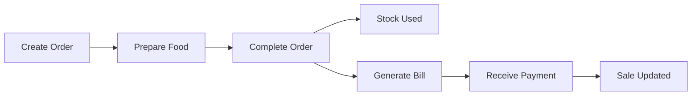
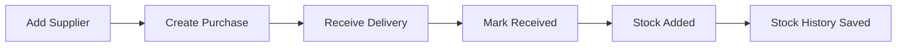
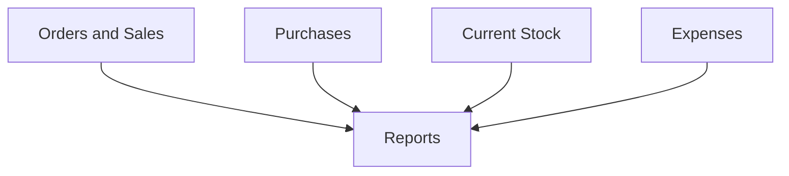
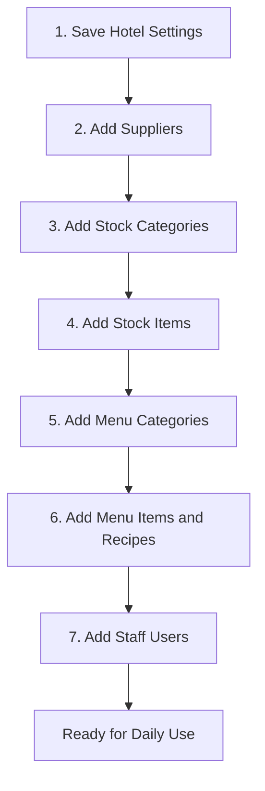
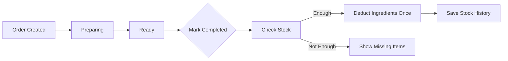
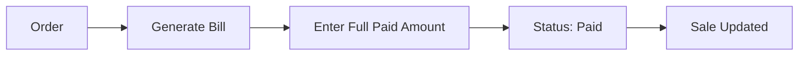
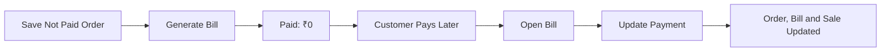
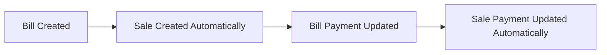
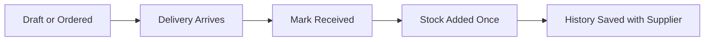
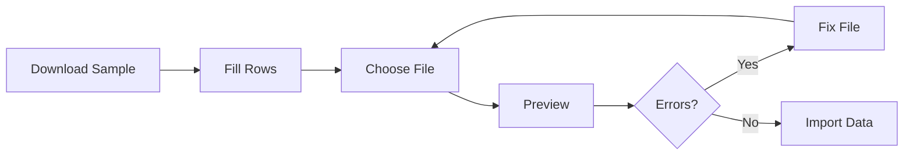

# Hotel Anmol One — Owner Guide

This guide explains the software in simple language. It is written for the hotel owner, manager, cashier, waiter, and store staff.

For a presentation-style guide with visual cards, flows, calculations, and printable checklists, open [`HOTEL_ANMOL_ONE_VISUAL_GUIDE.html`](./HOTEL_ANMOL_ONE_VISUAL_GUIDE.html) in a web browser.

You do not need technical knowledge to use this guide.

---

## 1. Understand the whole system in one minute

The software manages two main flows.

### Customer flow



### Purchase flow



The Reports page brings both flows together:



---

## 2. Main menu explained

| Menu | What it is used for |
|---|---|
| Dashboard | See today's important numbers and alerts |
| Orders | Create and manage customer orders |
| Billing | Generate bills and collect payments |
| Sales | View sales created from bills |
| Purchases | Record items bought from suppliers |
| Stock | Check, add, or remove inventory |
| Menu | Manage food categories, prices, and recipes |
| Suppliers | Manage supplier details and purchase history |
| Expenses | Record rent, electricity, salary, and other costs |
| Reports | Review sales, purchases, expenses, stock, and payments |
| Users | Control staff accounts and access |
| Settings | Set hotel, billing, order, and stock defaults |
| Excel | Import or download business data |

If a staff member cannot see a menu option, they probably do not have permission to use it.

---

## 3. First-time setup

Complete these steps before entering real customer orders.



### 3.1 Save hotel settings

Open **Settings** and check:

- Hotel name
- Phone number
- Email
- Address
- GST or Tax number
- Currency
- Bill prefix
- Tax percentage
- Default additional charge
- Discount setting
- Bill footer message
- Low-stock alert
- Default minimum stock

Select **Save Settings**.

These details appear on bills and other records.

### 3.2 Add suppliers

Open **Suppliers → Add Supplier**.

Enter the supplier's name, phone number, contact person, and address. Email and GST number can be added when available.

### 3.3 Add stock categories

Open **Stock → Manage Categories**.

Useful categories include:

- Vegetables
- Grocery
- Dairy
- Drinks
- Cleaning
- Packaging

### 3.4 Add stock items

Open **Stock → Add Item**.

Example:

| Field | Example |
|---|---|
| Item Name | Paneer |
| Category | Dairy |
| Unit | Kg |
| Opening Stock | 10 |
| Purchase Price | ₹400 |
| Minimum Stock | 2 |
| Supplier | Fresh Farm Foods |

Choose the unit used to count the complete stock item:

| Item | Recommended stock unit |
|---|---|
| Paneer, rice, flour | Kg |
| Oil, milk, sauce | Litre |
| Egg, bun, bottle | Piece |

### 3.5 Add menu categories and menu items

Open **Menu → Categories** and create categories such as Breakfast, Starter, Main Course, Drinks, and Dessert.

Then open **Menu Items → Add Menu Item**.

Enter:

- Item name
- Category
- Selling price
- Serving or quantity, such as `1 Plate`, `1 Glass`, or `250 ml`
- Availability
- Track Stock

Enable **Track Stock** only when the item should use stock according to a recipe.

---

## 4. Stock units and recipes

This is the most important stock concept.

The stock item keeps the total available quantity. The menu recipe keeps the quantity used by one serving.

### Example: Paneer Tikka

The stock room has:

```text
Paneer: 10 Kg
Curd: 5 Kg
Oil: 3 Litre
```

One plate uses:

| Ingredient | Used for one plate | Stock is stored in |
|---|---:|---|
| Paneer | 250 Gram | Kg |
| Curd | 100 Gram | Kg |
| Oil | 20 ml | Litre |

If the customer orders three plates:

```text
Paneer: 250 Gram × 3 = 750 Gram = 0.75 Kg
Curd:   100 Gram × 3 = 300 Gram = 0.30 Kg
Oil:     20 ml × 3 = 60 ml = 0.06 Litre
```

New stock after completing the order:

```text
Paneer: 10.00 − 0.75 = 9.25 Kg
Curd:    5.00 − 0.30 = 4.70 Kg
Oil:     3.00 − 0.06 = 2.94 Litre
```

The software supports these simple conversions:

- Kg and Gram
- Litre and ml
- Piece with Piece

Do not mix unrelated units. For example, ml cannot be deducted from an item stored in Kg.

### When stock is deducted



Remember:

- Creating an order does not deduct stock.
- Generating a bill does not deduct stock.
- Receiving payment does not deduct stock.
- Marking an order **Completed** deducts recipe stock once.
- Cancelling an order before completion does not deduct stock.
- A menu item with **Track Stock = No** does not affect inventory.

---

## 5. Create and complete a customer order

Open **Orders → New Order**.

1. Choose Dine In, Parcel, or Room.
2. Select the area type.
3. Enter the table, area, or room number.
4. Enter the customer name.
5. Select a menu item.
6. Enter its quantity.
7. Add more items when required.
8. Check discount and additional charges.
9. Choose Paid or Not Paid.
10. Select **Save Order**.

The software calculates:

```text
Item Amount = Quantity × Rate
Subtotal = Total of all item amounts
Final Amount = Subtotal − Discount + Additional Charges
```

### Order statuses

| Status | Use it when |
|---|---|
| Pending | The order has just been received |
| Preparing | The kitchen is making the order |
| Ready | The order is ready to serve or pack |
| Completed | The order has been served or handed over |
| Cancelled | The order will not be prepared |

Only select **Completed** after the food is actually finished. Completing the order updates stock.

### If stock is not enough

The software will not complete the order. It shows:

- Ingredient name
- Required quantity
- Available quantity

Add the missing stock and then try **Completed** again.

---

## 6. Generate a bill and receive payment

Open the Order Details page and select **Generate Bill**.

Only one bill is created for each order. If a bill already exists, the software opens that bill instead of creating another one.

### Customer pays immediately



### Customer pays later

This is the correct flow for a **Not Paid** order:



Do not manually change only the order payment status. Always update the payment from **Bill Details** so every connected record stays correct.

### Partial payment

Example:

```text
Final Amount: ₹1,000
Paid Now:       ₹400
Due Amount:     ₹600
Status: Partial
```

When the customer pays the remaining ₹600, open the same bill and update the paid amount to ₹1,000.

### Payment rules

| Paid amount | Status |
|---:|---|
| ₹0 | Not Paid |
| More than ₹0 but less than final amount | Partial |
| Equal to final amount | Paid |

```text
Due Amount = Final Amount − Paid Amount
```

Payment types are Cash, UPI, and Card.

From Bill Details:

- **Print Bill** prints a clean bill.
- **Download Bill** saves a PDF bill.

---

## 7. Understand Sales

Do not create sales manually.



Use Sales to review:

- Total sales
- Paid amount
- Due amount
- Cash sales
- UPI sales
- Card sales

---

## 8. Buy stock from a supplier

Use Purchases when goods come from a supplier.

Open **Purchases → New Purchase**.

1. Select the supplier.
2. Enter purchase date and supplier invoice number.
3. Add stock items.
4. Enter quantity, unit, and purchase price.
5. Enter payment details.
6. Save as Draft or Ordered.

When the delivery arrives, open Purchase Details and select **Mark as Received**.



Important:

- Stock increases only after **Mark as Received**.
- The same purchase cannot add stock twice.
- Do not use manual Stock In for the same purchase.
- A received purchase is historical business data and should not be deleted.

---

## 9. Manual Stock In and Stock Out

### Manual Stock In

Use this only when stock is not coming through a normal purchase, for example:

- Opening balance
- Stock correction
- Free item received

Enter the item, quantity, price, supplier when known, reference, date, and note.

### Manual Stock Out

Use this when stock is removed without a completed customer order, for example:

- Kitchen Usage
- Wastage
- Damage
- Adjustment
- Other

The software does not allow stock to go below zero.

### Stock statuses

| Quantity | Status |
|---|---|
| Zero | Out of Stock |
| At or below minimum stock | Low Stock |
| Above minimum stock | In Stock |

### Stock History

Every stock movement is saved. The history shows the old quantity, movement quantity, new quantity, reason, supplier, and reference.

Select an order or purchase reference to open its details.

---

## 10. Record expenses

Use Expenses for running costs such as:

- Rent
- Electricity
- Gas
- Salary
- Maintenance
- Transport
- Wastage
- Other

Open **Expenses → Add Expense**, enter the details, and save.

Do not enter supplier purchases as general expenses. Purchases and Expenses are separate records.

---

## 11. Read reports

Open **Reports** and choose the required report:

- Sales
- Purchases
- Expenses
- Stock
- Payments
- Orders

To check a date period:

1. Select the From date.
2. Select the To date.
3. Choose any extra filters.
4. Select **View**.

Dates are selected from the calendar and displayed as `DD/MM/YY`.

Use **Clear** to remove filters. Use **Print** for a paper copy and **Download Report** for an Excel file.

Reports use saved business records. They should not be calculated by hand.

---

## 12. Staff users and permissions

| Role | Recommended person |
|---|---|
| Admin | Owner or trusted administrator |
| Manager | Hotel or restaurant manager |
| Cashier | Billing and payment staff |
| Waiter | Order-taking staff |
| Staff | Store or operating staff |

Permissions decide whether a person can View, Create, Edit, or Delete information in each module.

Recommended safety rules:

- Keep at least one active Admin account.
- Do not share the Admin password.
- Give staff only the access needed for their work.
- Deactivate an account when the employee leaves.
- Review permissions after changing a person's role.

---

## 13. Excel import and export

### Import safely



Rules:

- Start with the sample file.
- Do not change column names.
- Preview before importing.
- Fix invalid rows before confirming.
- Check the result for imported, skipped, and failed rows.

### Export

Exports are available for Orders, Sales, Purchases, Stock, Expenses, Suppliers, Menu Items, and Reports.

Choose dates when the export provides date filters, then select **Export Excel**.

---

## 14. Delete, cancel, deactivate, or mark unavailable?

Use the safest action for the situation:

| Situation | Recommended action |
|---|---|
| Wrong order that has not affected stock or billing | Cancel or delete when allowed |
| Completed order | Keep it for stock and report history |
| Supplier no longer used | Mark Inactive |
| Menu item temporarily not sold | Mark Unavailable |
| Stock item no longer purchased | Mark Inactive |
| Staff member leaves | Mark user Inactive |
| Received purchase | Keep it because it changed stock |

The delete confirmation checks whether another record is using the entry. If it is being used, follow the places shown in the message before trying again.

Never delete business history only to make a report look different. Correct the related entry using the proper business action.

---

## 15. Daily owner routine

### Opening checklist

- [ ] Open Dashboard.
- [ ] Check Low Stock and Out of Stock items.
- [ ] Receive delivered purchases.
- [ ] Check unavailable menu items.
- [ ] Confirm staff can log in.

### During service

- [ ] Create orders correctly.
- [ ] Update Pending, Preparing, and Ready statuses.
- [ ] Mark served orders Completed.
- [ ] Generate bills.
- [ ] Record full or partial payments.
- [ ] Record wastage when it happens.

### Closing checklist

- [ ] Check Not Paid and Partial bills.
- [ ] Enter all daily expenses.
- [ ] Review Sales report.
- [ ] Review Payment report.
- [ ] Check manual Stock Out entries.
- [ ] Prepare tomorrow's purchase list from Low Stock items.

---

## 16. Common questions

### Why did stock not decrease after creating an order?

Stock decreases only when the order is marked **Completed**.

### Why did stock not increase after creating a purchase?

Stock increases only when the purchase is marked **Received**.

### The customer paid later. Where should I update it?

Open the existing bill and use **Update Payment**. The Order and Sale will update automatically.

### Why can I not complete an order?

Check the insufficient-stock message. Add the missing ingredient or correct its recipe.

### Why can I not delete an entry?

The entry is probably connected to another business record. Read the short dependency message and use Inactive, Unavailable, or Cancelled when suitable.

### Why is a menu item missing from New Order?

Check that the menu item and its category are both Active or Available.

### Why is a menu option missing from the sidebar?

The logged-in user does not have View permission for that module.

### Why does a number look wrong in a report?

Check the selected dates and filters first. Then open the related order, bill, purchase, or expense record.

---

## 17. Five rules to remember

```text
1. Received purchases add stock.
2. Completed orders use stock.
3. Bills create sales.
4. Bill payments update orders and sales.
5. Expenses and all saved activity appear in reports.
```

Following these five rules keeps stock, payments, and reports correct.
